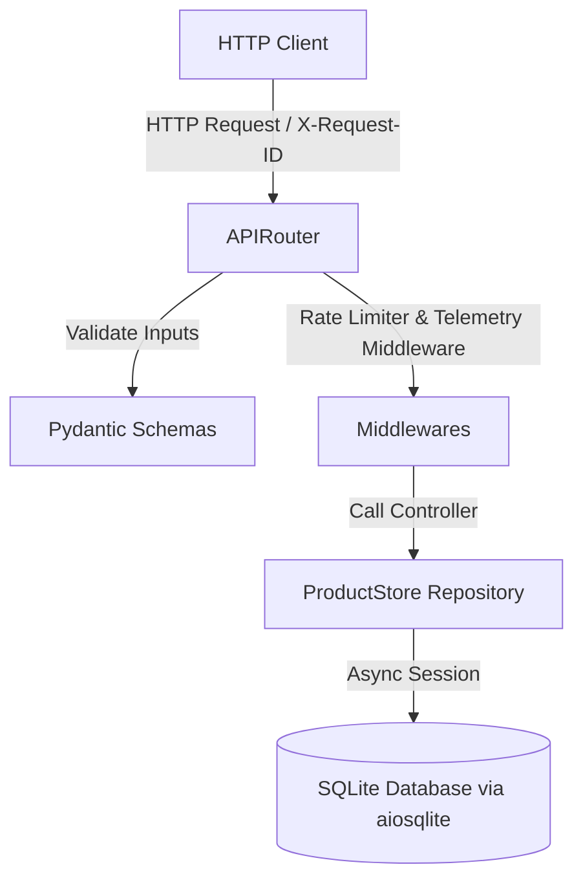

# Portfolio-Grade REST Engine

An enterprise-ready, portfolio-grade FastAPI microservice architecture designed for high-concurrency, structured telemetry, rate-limiting, and async database persistence (SQLAlchemy 2.0 + SQLite/aiosqlite).

---

## 🚀 Key Features

*   **Async Persistence Layer:** Fully asynchronous database transactions using SQLAlchemy 2.0 ORM with aiosqlite (SQLite).
*   **Dynamic Filtering & Pagination:** Advanced search capabilities, multi-field filtering, sorting (`price`, `created_at`), and paginated response wrappers.
*   **Security & Rate Limiting:** Request-rate limiting using `slowapi`, CORS configuration, Trusted Host controls, and custom security headers (`X-Content-Type-Options`, `X-Frame-Options`, `X-XSS-Protection`).
*   **Structured Telemetry:** Request correlation tracking using unique `X-Request-ID` UUIDs, request logging with latency tracking, and structured JSON logs via `loguru`.
*   **Continuous Integration (CI):** Fully automated testing and build integrity pipelines configured with GitHub Actions.

---

## 📐 Architecture & Modular Design



We adhere to the **Separation of Concerns (SoC)** architectural pattern:
*   `app/api/v1/`: Handles incoming routes, API-specific logic, and request formatting.
*   `app/core/`: Contains environment configuration settings and middleware registries.
*   `app/db/`: Contains database connection pools (`session.py`), ORM definitions (`models.py`), and query abstraction / repository logic (`store.py`).
*   `app/schemas/`: Houses structural input/output models using Pydantic.

---

## 🛠️ Tech Stack & Tooling

*   **FastAPI:** Modern Python web framework with asynchronous runtime.
*   **Uvicorn:** Ultra-fast ASGI server implementation.
*   **SQLAlchemy 2.0:** Object-Relational Mapper (ORM) using the 2.0 declarative system.
*   **aiosqlite:** Async bridge driver for SQLite.
*   **slowapi:** Rate limiter integration based on `limits`.
*   **loguru:** Robust and structured JSON logging engine.
*   **pytest & HTTPX:** High-performance unit and integration testing suite.

---

## 📦 Local Installation & Setup

1. **Clone the repository:**
   ```bash
   git clone https://github.com/hafizabdulaziz/decodelabs-task1-rest-api-engine.git
   cd decodelabs-task1-rest-api-engine
   ```

2. **Create and Activate Virtual Environment:**
   ```bash
   python -m venv .venv
   # On Windows
   .venv\Scripts\activate
   # On Unix/macOS
   source .venv/bin/activate
   ```

3. **Install Dependencies:**
   ```bash
   pip install -r requirements.txt
   ```

4. **Run Application Server:**
   ```bash
   uvicorn app.main:app --reload
   ```
   Open `http://127.0.0.1:8000/docs` in your browser to view the interactive API documentation (Swagger UI).

---

## 🧪 Running Automated Tests

Run the full pytest suite with:
```bash
pytest
```

---

## 🛡️ Telemetry & Security Insights

Every HTTP request creates a unique log structure containing:
*   `request_id`: Tracing correlation identifier (`X-Request-ID`).
*   `method`: HTTP Request method (e.g., `GET`, `POST`).
*   `path`: Endpoint destination path.
*   `status_code`: Response integrity status code.
*   `latency`: Processing execution duration.

Rate limit protection of `5/minute` is enforced on write/mutation APIs to prevent brute-force attacks and abuse.
